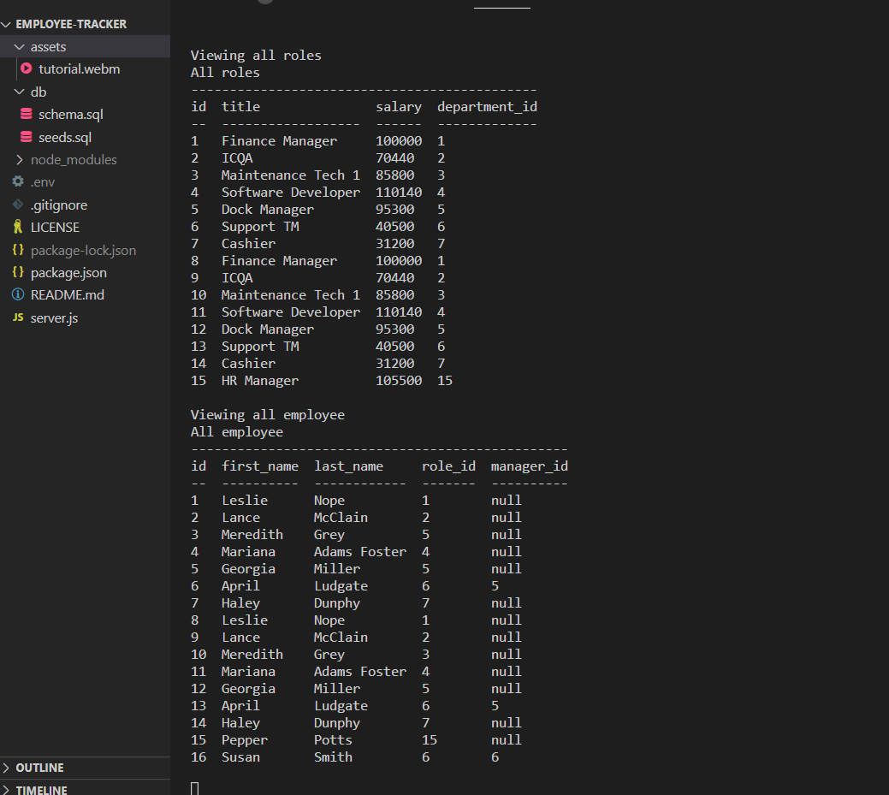

# employee-tracker

## Table of Contents
* [Description](#description)
* [Installation](#installation)
* [Usage](#usage)
* [Contributing](#contributing)
* [Tests](#tests)
* [Questions](#questions)
* [Credits](#credits)
* [Licenses](#license)
* [Screenshots](#screenshots)

## Description
- A quick and simple way to track employees, roles and salaries to better maintain a business budget.

## Installation
- Visit the GitHub repo linked below and clone it to your local storage by downloading a zip or importing using GitHub to your own repo.
- Github repo: [https://github.com/lesliefg/employee-tracker] 
- Tutorial: [https://drive.google.com/file/d/1t28nSIMHPaMYDuAN6qGK2TV6DaIEbjMy/view] Also available in the assets folder

### Make sure to have the following things installed
* VS Code
* GitBash
* Node.js

### Then follow these steps to install the project
1. Follow the Github repo link above.
2. Clone the repo using Gitbash with the command "git clone (link)" OR download the entire repo as a zip file.
3. Once open in VS Code, install NPM using "npm i" in the terminal
5. Next install inquirer using "npm i inquirer@8.2.4" in the terminal
6. Instal console.table to print MySQL rows to the console using "npm install console.table" for more instructions check the link in the credits below.
7. Optional: install dotenv to save password locally using "npm i dotenv" for more instructions check the link in the credits below.
8. Optional: create a .env file and add "SET_DBPW = "PASSWORD" for it to auto run with your password.

## Usage
- In order to use simply download the repo locally, follow installation instructions above and then run using the following commands:
1. "mysql -u root -p"
2. Enter password when prompted.
3. "SOURCE ./db/schema.sql"
4. "SOURCE ./db/seeds.sql"
5. "Exit"
6. "npm start"
7. Server will now run and you can then use any of the provided prompts!
8. To exit you can use the "Exit" option or use CTRL + C

## Questions
- For any questions reach out through github or email!  
- GitHub: [https://github.com/lesliefg]
- Email: leslie.garcia2433@gmail.com

## Credits
- Code written by leslie
- Console.table package instructions [https://www.npmjs.com/package/console.table]
- Dotenv package instructions [https://www.npmjs.com/package/dotenv]

## Licenses
    - This project has a MIT license. To learn more about this license type click the license button at the top of the README.

## Screenshots & Tutorial

[https://drive.google.com/file/d/1t28nSIMHPaMYDuAN6qGK2TV6DaIEbjMy/view]
